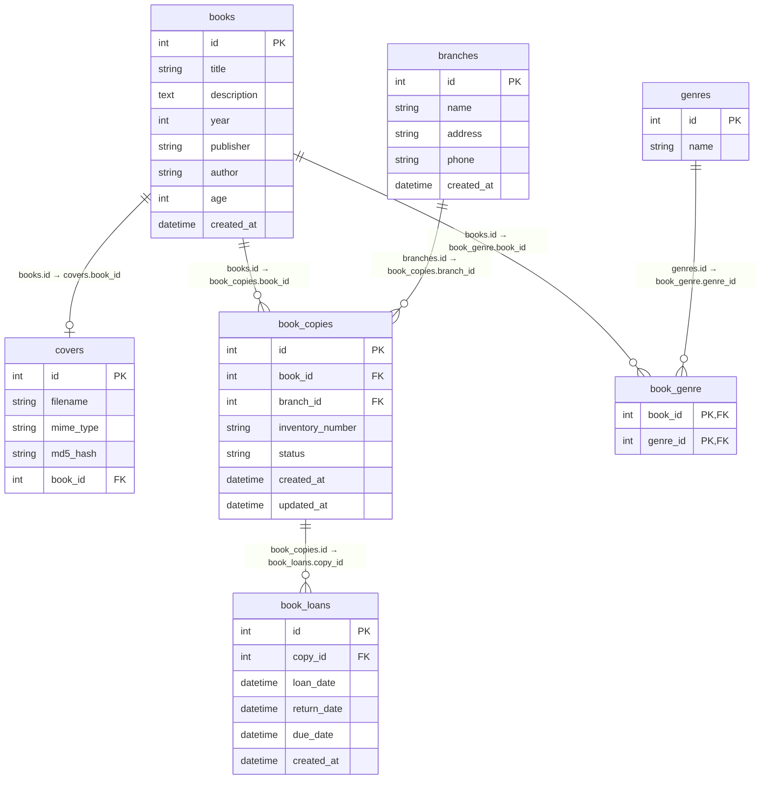
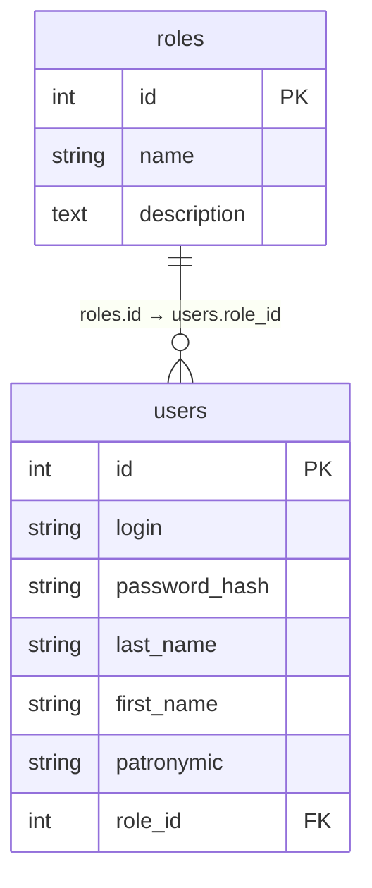

# Электронная библиотека

Веб-приложение для учёта книг, филиалов, экземпляров и их использования.

## Стек технологий

- **Python 3.11**
- **Flask 3.0.3** — веб-фреймворк
- **Flask-SQLAlchemy 3.1.1** — ORM для работы с БД
- **Flask-Login 0.6.3** — аутентификация и сессии
- **SQLite** — реляционная БД (`library.db`, `users.db`)
- **Jinja2** — шаблонизатор
- **Bootstrap 5** — вёрстка
- **Pillow** — обработка обложек
- **bleach + markdown** — безопасный HTML и разметка описаний

## Структура проекта
````
app/
├── instance/
│ ├── library.db # книги, жанры, филиалы, экземпляры, выдачи
│ └── users.db # роли и пользователи
├── static/
│ ├── images/ # обложки и аватары
│ └── styles.css
├── templates/
│ ├── 400.html # некорректный запрос
│ ├── 403.html # доступ запрещён
│ ├── 404.html # страница не найдена
│ ├── 413.html # файл слишком большой
│ ├── 500.html # внутренняя ошибка
│ ├── base.html # базовый шаблон
│ ├── book_branches.html # филиалы книги
│ ├── book_form.html # форма создания/редактирования книги
│ ├── book_view.html # карточка книги
│ ├── books_list.html # список книг с поиском и пагинацией
│ └── login.html # форма входа
├── app.py # точка входа, маршруты, обработчики ошибок, /health
├── auth.py # blueprint аутентификации
├── books.py # blueprint книг и филиалов
├── config.py # конфигурация из переменных окружения
├── models.py # модели SQLAlchemy
├── version.py # версия приложения
├── requirements.txt
├── .env.example # шаблон переменных окружения
└── .gitignore
````

## Установка и запуск

### 1. Клонирование

```bash
git clone https://github.com/KolesnikovaIrina412/DevOps
cd DevOps/app
```

### 2. Виртуальное окружение

```bash
# Windows (PowerShell)
py -3.11 -m venv .venv
.\.venv\Scripts\Activate.ps1

# Linux / macOS
python3.11 -m venv .venv
source .venv/bin/activate
```

### 3. Установка зависимостей

```bash
pip install -r requirements.txt
```

### 4. Настройка переменных окружения

Скопировать `.env.example` в `.env` и заполнить значения:

```bash
# Windows
copy .env.example .env

# Linux / macOS
cp .env.example .env
```

Сгенерировать надёжный `SECRET_KEY`:

```bash
python -c "import secrets; print(secrets.token_hex(32))"
```

### 5. Запуск

```bash
python app.py
```

Приложение будет доступно по адресу: <http://127.0.0.1:5000>

При первом запуске автоматически создаются:
- таблицы в обеих БД (`library.db`, `users.db`);
- роли `admin` и `user`;
- тестовые пользователи;
- список жанров.

## Тестовые пользователи

| Роль | Логин | Пароль | Возможности |
| :--- | :--- | :--- | :--- |
| Администратор | `admin` | `admin123` | Полный доступ: просмотр, добавление, редактирование, удаление книг, работа с филиалами |
| Пользователь | `user` | `user123` | Только просмотр книг и информации о филиалах |

## Переменные окружения

Все настройки читаются из файла `.env` (см. `.env.example`).

| Переменная | Описание | Значение по умолчанию |
| :--- | :--- | :--- |
| `SECRET_KEY` | Секретный ключ для сессий и CSRF | `dev-secret-key-change-me` |
| `MAX_CONTENT_LENGTH` | Максимальный размер загружаемого файла (байты) | `16777216` (16 МБ) |
| `FLASK_DEBUG` | Режим отладки: `1` — вкл, `0` — выкл | `0` |

> ⚠️ Пути к БД (`library.db`, `users.db`) и папке загрузок формируются автоматически в `config.py` и не требуют указания в `.env`.

## API

| Метод | Маршрут | Описание | Доступ |
| :--- | :--- | :--- | :--- |
| GET | `/` | Редирект на список книг | Все |
| GET | `/books/` | Список книг с поиском, фильтрацией и пагинацией | Все |
| GET | `/books/book/<int:book_id>` | Карточка книги | Все |
| GET | `/books/book/<int:book_id>/branches` | Статистика по филиалам для книги | Все |
| GET | `/books/book/create` | Форма добавления книги | Только admin |
| POST | `/books/book/create` | Создание книги | Только admin |
| GET | `/books/book/<int:book_id>/edit` | Форма редактирования книги | Только admin |
| POST | `/books/book/<int:book_id>/edit` | Обновление книги | Только admin |
| POST | `/books/book/<int:book_id>/delete` | Удаление книги | Только admin |
| GET | `/books/init-branches` | Создание тестовых филиалов | Только admin |
| POST | `/books/book/<int:book_id>/branches/update` | Обновление статистики филиала | Только admin |
| GET | `/auth/login` | Форма входа | Все |
| POST | `/auth/login` | Аутентификация | Все |
| GET | `/auth/logout` | Выход | Авторизованные |
| GET | `/health` | Проверка работоспособности | Все |
| GET | `/version` | Версия приложения | Все |

### Параметры поиска (`/books/`)

| Параметр | Тип | Описание |
| :--- | :--- | :--- |
| `title` | string | Часть названия книги |
| `author` | string | Часть имени автора |
| `genres` | list[int] | ID жанров (можно несколько) |
| `years` | list[int] | Годы издания (можно несколько) |
| `age` | list[int] | Возрастные ограничения (можно несколько) |
| `page` | int | Номер страницы (по умолчанию 1, размер 10) |

## Проверка работоспособности

Маршрут `/health` возвращает JSON со статусом приложения и доступностью обеих БД.

**Пример успешного ответа (HTTP 200):**

```json
{
  "status": "ok",
  "version": "0.1.0",
  "database": "ok",
  "auth_database": "ok"
}
```

**Пример ответа при недоступности БД (HTTP 503):**

```json
{
  "status": "error",
  "version": "0.1.0",
  "database": "error: ...",
  "auth_database": "ok"
}
```

## Схема данных

### `library.db` (основная БД)



**Связи:**
- `books.id` → `covers.book_id` — one-to-one.
- `books.id` → `book_copies.book_id` — one-to-many.
- `books.id` → `book_genre.book_id` — one-to-many.
- `genres.id` → `book_genre.genre_id` — one-to-many.
- `branches.id` → `book_copies.branch_id` — one-to-many.
- `book_copies.id` → `book_loans.copy_id` — one-to-many.

### `users.db` (БД пользователей)



**Связи:**
- `roles.id` → `users.role_id` — one-to-many.

## Справочные правила предметной области

1. **Баланс экземпляров:** для каждого филиала сумма `available + issued` должна равняться `total`. Проверяется при обновлении статистики филиала (`branches_update`).
2. **Дедупликация обложек:** при загрузке обложки вычисляется MD5-хэш. Если такая обложка уже существует — новая запись `Cover` ссылается на тот же файл, а не создаёт дубликат.
3. **Права доступа:** редактирование и удаление книг, работа с филиалами — только для роли `admin`. Роль `user` имеет доступ только к просмотру.

## Правила внесения изменений

Правила работы с репозиторием, обязательные проверки, запрещённые действия и порядок приёмки описаны в отдельном документе — [CONTRIBUTING.md](CONTRIBUTING.md).

## Лицензия

Учебный проект. Лабораторная работа №1 по дисциплине «Методологии и практики DevOps».
